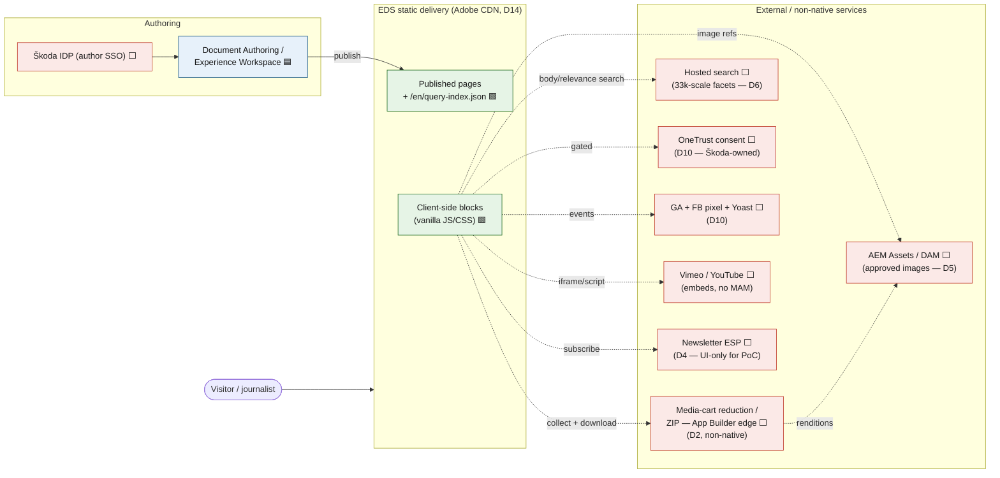
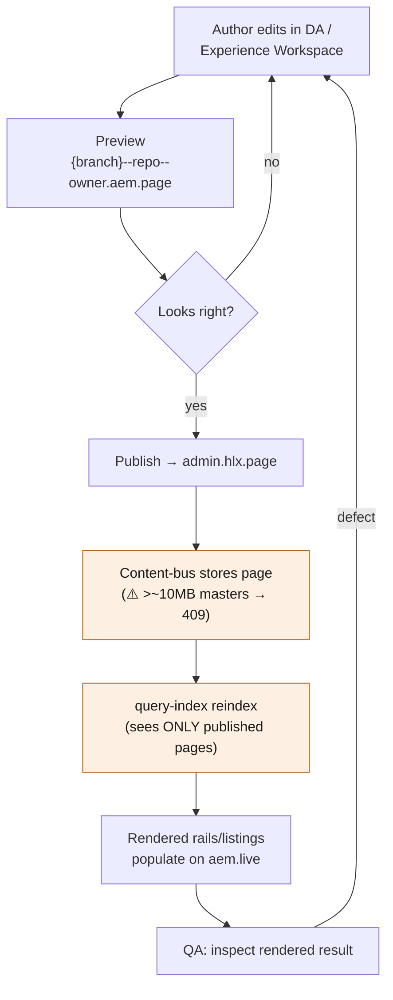

# Škoda Storyboard & Media Room — Architecture Diagrams

*Integration + flow diagrams for the WordPress → Adobe Edge Delivery Services (EDS) + Document Authoring (DA) migration. Mermaid source (renders on GitHub). Companion to `SKODA-MASTER.md` (§4 blocks, §10 boundary), `SKODA-REQUIREMENTS-TRACEABILITY.md` (page-type → ticket), `SKODA-DELIVERY-PLAN.md` (D1–D19). The integration diagram is also embedded in `../planning/SKODA-SOLUTION-DESIGN.html` and `../planning/SKODA-EXEC-BRIEFING.html`.*

**Date:** 2026-09-15 · Legend for build state: 🟩 built on `/en` · 🟦 assembly of built parts · 🟧 net-new · ⬜ external service / non-native to EDS.

---

## 1. Integration architecture — the static ↔ service boundary

What EDS serves as static content from the CDN vs. what lives in external systems. Everything on the **right** is a dependency we do not fully control; the red items are non-native to EDS (no origin compute) and drive the top risks (D2/D5).

**Reading it:** the demo's headline dynamic feature (media-cart real download) crosses three red boundaries at once — **DAM (D5)**, **reduction/ZIP (D2)**, and CORS delivery — which is exactly why it's the #1 M1 risk. Consent (D10) is out of Adobe scope entirely.

---

## 2. Content / authoring flow — the publish → reindex loop

The loop that gated the autonomous agent cycle: **the query-index only sees *published* pages**, so index-driven rails stay empty until publish + reindex complete.

**Why it matters:** merging code (`main`) and publishing content are **separate**. A content or transformer fix is not verifiable to DONE until it has gone through this whole loop — the boundary that stopped the agent-team cycle from closing tickets 605/606.

---

## 3. Migration / import pipeline — source → published EDS

The reusable import machinery in `tools/importer/`. Two pipelines exist (`en-landing`, `en-stories`); new page types are config + reuse, not new machinery.

```mermaid
flowchart LR
  SRC["Source WordPress page<br/>skoda-storyboard.com"] --> SCR["Scrape<br/>cleaned.html + metadata + images"]
  SCR --> PT["page-templates.json<br/>(template + block→selector map)"]
  PT --> PAR["Block parsers<br/>(cards-*, carousel)"]
  PT --> TRF["Page transformers<br/>(cleanup / sections / story-cleanup)"]
  PAR --> BUN["import-&lt;name&gt;.bundle.js<br/>(runnable artifact)"]
  TRF --> BUN
  BUN --> RUN["run-bulk-import.js"]
  RUN --> OUT["content/&lt;path&gt;.plain.html"]
  OUT --> UP["push-to-da.mjs (SKODA-602)<br/>wrap &lt;body&gt;&lt;main&gt; → POST DA source-API<br/>(overwrite protection via push-manifest)"]
  UP --> PUB["Bulk preview → validate → bulk publish<br/>(+ /nav, /footer live) → reindex"]
  PUB --> LIVE["Live on /en + query-index"]

  MEDIA["Media pre-conditioning<br/>(strip >~10MB masters)"] -.-> UP

  classDef built fill:#e6f4e6,stroke:#1e6b1e,color:#1a1a1a;
  classDef gate fill:#fdf0e2,stroke:#b5651d,color:#1a1a1a;
  class SCR,PT,PAR,TRF,BUN,RUN,OUT,UP built;
  class MEDIA,PUB gate;
```

**Gotchas baked in:** DA docs must be wrapped `<body><main>` on upload; bulk migration is out of the PoC (§9 — demo uses a hand-carried sample); the scraper can client-side-redirect (verify against raw SSR). See `IMPORT-PIPELINE.md`.

---

## Cross-references
- `../analysis/SKODA-MASTER.md` — §4 block inventory, §10 static↔service boundary (source for diagrams 1–2).
- `SKODA-EDS-DA-ARCHITECTURE.md` — target architecture + the static/dynamic split.
- `IMPORT-PIPELINE.md` — the import pipeline narrative (diagram 4).
- `../planning/SKODA-REQUIREMENTS-TRACEABILITY.md` — page-type → ticket → milestone.
- `../planning/SKODA-DELIVERY-PLAN.md` §8 — decisions D1–D19 referenced in the integration diagram.
